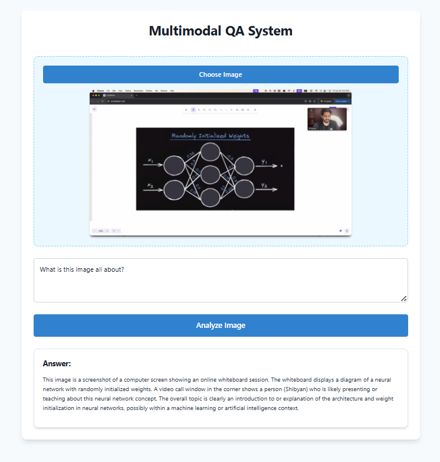

# Multimodal QA System

A modern web application that enables users to upload images and ask questions about them using Google's Gemini Pro Vision API. The system provides intelligent responses by analyzing the visual content and understanding natural language queries.



## 🌟 Features

- **Image Analysis**: Upload and analyze any image using Google's advanced vision AI
- **Natural Language Questions**: Ask questions in plain English about the uploaded image
- **Smart Fallback**: Automatic fallback to text-only model if image analysis encounters issues
- **Modern UI/UX**: 
  - Sleek, responsive design using Chakra UI
  - Real-time image preview
  - Markdown rendering for formatted responses
  - Interactive hover states and animations
- **Error Handling**: Comprehensive error handling with user-friendly notifications

## 🛠️ Tech Stack

### Frontend
- **React 18** with Vite for fast development and optimal build
- **Chakra UI** for modern, accessible components
- **React Markdown** for formatted response rendering
- **Axios** for API communication

### Backend
- **FastAPI** for high-performance API endpoints
- **Python 3.8+** for robust server-side processing
- **Google Gemini Pro Vision API** for AI-powered image analysis
- **PIL (Python Imaging Library)** for image processing

## 📁 Project Structure

```
multimodal-qa/
├── backend/
│   ├── app.py                # FastAPI application
│   ├── requirements.txt      # Python dependencies
│   ├── .env.example         # Environment variables template
│   └── .gitignore           # Backend specific ignores
│
├── frontend/
│   ├── src/
│   │   ├── App.jsx          # Main React component
│   │   ├── api.js           # API integration
│   │   ├── markdown.css     # Markdown styling
│   │   └── main.jsx         # React entry point
│   ├── public/              # Static assets
│   ├── assets/              # Project assets
│   ├── package.json         # Node.js dependencies
│   └── vite.config.js       # Vite configuration
│
└── README.md                # Project documentation
```

## 🚀 Getting Started

### Prerequisites

- Python 3.8 or higher
- Node.js 16 or higher
- Google API Key for Gemini (Get it from [Google AI Studio](https://makersuite.google.com/app/apikey))
- Git (for cloning the repository)

### Backend Setup

1. Clone the repository and navigate to the backend directory:
   ```bash
   git clone <repository-url>
   cd backend
   ```

2. Create and activate a virtual environment:
   ```bash
   # Windows
   python -m venv venv
   .\venv\Scripts\activate

   # Unix/macOS
   python -m venv venv
   source venv/bin/activate
   ```

3. Install dependencies:
   ```bash
   pip install -r requirements.txt
   ```

4. Set up environment variables:
   ```bash
   # Copy the example env file
   cp .env.example .env
   
   # Edit .env with your configuration
   # Replace your_api_key_here with your actual Gemini API key
   GOOGLE_API_KEY=your_api_key_here
   ```
   
   The `.env.example` file contains:
   - Required API keys and their sources
   - Optional configuration settings
   - Server configuration options
   - Detailed comments for each setting

5. Start the backend server:
   ```bash
   uvicorn app:app --reload
   ```
   The server will run on `http://localhost:8000`

### Frontend Setup

1. Navigate to the frontend directory:
   ```bash
   cd frontend
   ```

2. Install dependencies:
   ```bash
   npm install
   ```

3. Start the development server:
   ```bash
   npm run dev
   ```
   The application will be available at `http://localhost:5173`

## 📝 Usage Guide

1. **Upload an Image**
   - Click the "Choose Image" button
   - Select any image file from your computer
   - A preview will appear below the button

2. **Ask a Question**
   - Type your question about the image in the text area
   - Be specific and clear in your question

3. **Get AI Analysis**
   - Click the "Analyze Image" button
   - Wait for the AI to process your request
   - The response will appear below with proper formatting

## 🎯 Sample Use Cases

1. **Technical Diagram Analysis**
   - Upload architectural diagrams
   - Ask about specific components
   - Get detailed explanations of workflows

2. **Educational Content**
   - Upload educational materials
   - Ask for explanations or clarifications
   - Get detailed breakdowns of concepts

3. **General Image Analysis**
   - Upload any image
   - Ask about objects, text, or context
   - Get comprehensive descriptions

## 🔧 API Integration Details

The application integrates with two Gemini models:

1. **Gemini Pro Vision**
   - Primary model for image analysis
   - Handles multimodal queries (image + text)
   - Provides detailed visual understanding

2. **Gemini Pro (Fallback)**
   - Secondary model for text-only responses
   - Activates if image analysis fails
   - Ensures continuous service availability

## 🛡️ Error Handling

The application implements robust error handling:

- **Input Validation**
  - Image file type verification
  - Required field checks
  - Size limitations enforcement

- **API Error Handling**
  - Graceful fallback mechanisms
  - User-friendly error messages
  - Automatic retry logic

- **UI Feedback**
  - Loading states
  - Error notifications
  - Success confirmations

## 🔜 Future Roadmap

1. **Enhanced Features**
   - Image URL support
   - Batch image processing
   - Query history tracking
   - Export functionality

2. **Technical Improvements**
   - Response caching
   - Performance optimization
   - Advanced error recovery

3. **User Experience**
   - Customizable UI themes
   - Keyboard shortcuts
   - Mobile optimization

## 🤝 Contributing

Contributions are welcome! Please feel free to submit a Pull Request. For major changes, please open an issue first to discuss what you would like to change.

## 📄 License

This project is licensed under the MIT License - see the [LICENSE](LICENSE) file for details.

## 🙏 Acknowledgments

- Google Gemini API for powerful AI capabilities
- The FastAPI team for the excellent framework
- The Chakra UI team for beautiful components
- All contributors and users of this project 